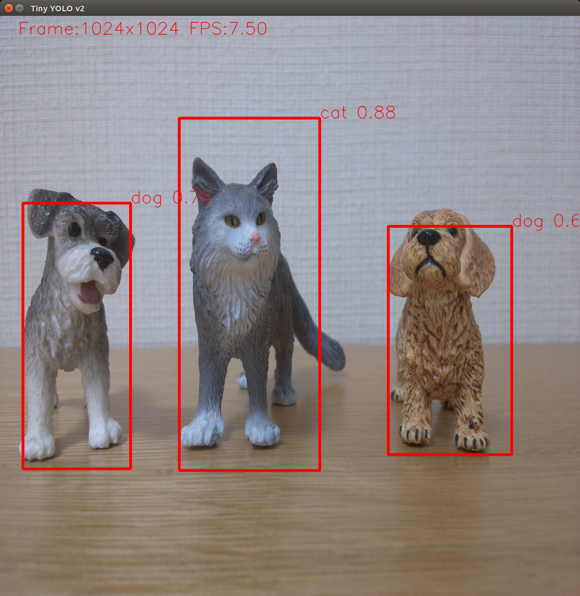

# tiny_yolov2_onnx_cam
**Tiny YOLO v2 Inference Application with NVIDIA TensorRT**



## What does this application do?

This application downloads the tiny YOLO v2 model from [Open Neural Network eXchange (ONNX) Model Zoo](https://github.com/onnx/models) and converts it to NVIDIA TensorRT plan, then starts the object detection for camera captured image.

## Prerequisites

- NVIDIA Jetson Nano Developer Kit
- USB Web Camera or Raspberry Pi Camera V2
- NVIDIA JetPack 4.2.1 or later

## Installation

```
$ sudo apt-get update

$ sudo apt-get install python3-pip protobuf-compiler libprotoc-dev libjpeg-dev cmake

$ git clone https://github.com/tsutof/tiny_yolov2_onnx_cam

$ cd tiny_yolov2_onnx_cam

$ export PATH=$PATH:/usr/local/cuda/bin

$ python3 -m pip install -r requirements.txt
```

## Usage

First, clock up your Jetson.

```
$ sudo nvpmodel -m 0
$ sudo jetson_clocks
```

The following command starts this application.

```
$ python3 tiny_yolov2_onnx_cam.py [camera_number]
```

For Raspberry Pi camera v2, use any negative number as the camera number.

```
$ python3 tiny_yolov2_onnx_cam.py -1 
```

For USB Web camera, if you camera is detected as /dev/video1, use 1 as the camera number.

```
$ python3 tiny_yolov2_onnx_cam.py 1
```

## Third Party License

This program is using open source software which is licensed by the following conditions:

```
#
# Copyright 1993-2019 NVIDIA Corporation.  All rights reserved.
#
# NOTICE TO LICENSEE:
#
# This source code and/or documentation ("Licensed Deliverables") are
# subject to NVIDIA intellectual property rights under U.S. and
# international Copyright laws.
#
# These Licensed Deliverables contained herein is PROPRIETARY and
# CONFIDENTIAL to NVIDIA and is being provided under the terms and
# conditions of a form of NVIDIA software license agreement by and
# between NVIDIA and Licensee ("License Agreement") or electronically
# accepted by Licensee.  Notwithstanding any terms or conditions to
# the contrary in the License Agreement, reproduction or disclosure
# of the Licensed Deliverables to any third party without the express
# written consent of NVIDIA is prohibited.
#
# NOTWITHSTANDING ANY TERMS OR CONDITIONS TO THE CONTRARY IN THE
# LICENSE AGREEMENT, NVIDIA MAKES NO REPRESENTATION ABOUT THE
# SUITABILITY OF THESE LICENSED DELIVERABLES FOR ANY PURPOSE.  IT IS
# PROVIDED "AS IS" WITHOUT EXPRESS OR IMPLIED WARRANTY OF ANY KIND.
# NVIDIA DISCLAIMS ALL WARRANTIES WITH REGARD TO THESE LICENSED
# DELIVERABLES, INCLUDING ALL IMPLIED WARRANTIES OF MERCHANTABILITY,
# NONINFRINGEMENT, AND FITNESS FOR A PARTICULAR PURPOSE.
# NOTWITHSTANDING ANY TERMS OR CONDITIONS TO THE CONTRARY IN THE
# LICENSE AGREEMENT, IN NO EVENT SHALL NVIDIA BE LIABLE FOR ANY
# SPECIAL, INDIRECT, INCIDENTAL, OR CONSEQUENTIAL DAMAGES, OR ANY
# DAMAGES WHATSOEVER RESULTING FROM LOSS OF USE, DATA OR PROFITS,
# WHETHER IN AN ACTION OF CONTRACT, NEGLIGENCE OR OTHER TORTIOUS
# ACTION, ARISING OUT OF OR IN CONNECTION WITH THE USE OR PERFORMANCE
# OF THESE LICENSED DELIVERABLES.
#
# U.S. Government End Users.  These Licensed Deliverables are a
# "commercial item" as that term is defined at 48 C.F.R. 2.101 (OCT
# 1995), consisting of "commercial computer software" and "commercial
# computer software documentation" as such terms are used in 48
# C.F.R. 12.212 (SEPT 1995) and is provided to the U.S. Government
# only as a commercial end item.  Consistent with 48 C.F.R.12.212 and
# 48 C.F.R. 227.7202-1 through 227.7202-4 (JUNE 1995), all
# U.S. Government End Users acquire the Licensed Deliverables with
# only those rights set forth herein.
#
# Any use of the Licensed Deliverables in individual and commercial
# software must include, in the user documentation and internal
# comments to the code, the above Disclaimer and U.S. Government End
# Users Notice.
#
```
