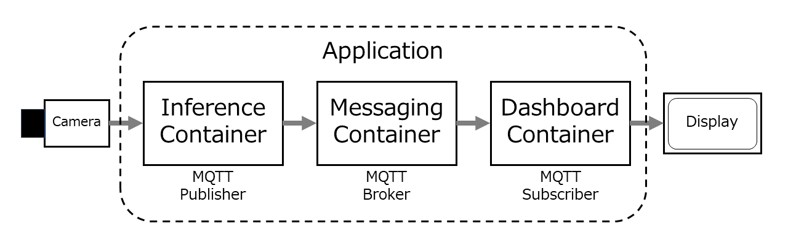
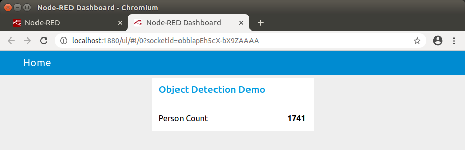

# マイクロサービス・デモ
**「Jetson Nano 超入門 改訂 第2版 9-4 Dockerを利用したデプロイメント」で紹介しているサンプルアプリケーション**



本デモはEclipse Mosquitto™をMQTTブローカーとして利用、Node-REDをダッシュボードとして利用しています。

## 前提する環境

- NVIDIA Jetson Nano開発者キット
- USBウェブカメラ、または、Raspberry Pi Camera V2
- NVIDIA JetPack **4.4 または、それ以降のバージョン**
- **runtime** オプションがサポートされたdocker-compose [（この項目を参照）](#runtime%E3%82%AA%E3%83%97%E3%82%B7%E3%83%A7%E3%83%B3%E3%81%8C%E3%82%B5%E3%83%9D%E3%83%BC%E3%83%88%E3%81%95%E3%82%8C%E3%81%9Fdocker-compose%E3%82%92%E3%82%A4%E3%83%B3%E3%82%B9%E3%83%88%E3%83%BC%E3%83%AB%E3%81%99%E3%82%8B%E6%96%B9%E6%B3%95)

## 実行方法

### サービスの起動
1. （もし、まだであったら）本リポジトリのクローン
```
$ git clone https://github.com/tsutof/tiny_yolov2_onnx_cam
```
2. シェルスクリプトファイルに実行権限を付与
```
$ cd tiny_yolov2_onnx_cam

$ chmod +x ./scripts/*.sh
```
3. Jetson Nanoの電力モードをモード0にして、クロックアップ
```
$ sudo nvpmodel -m 0

$ sudo jetson_clocks
```
4. サービスを起動（Raspbery Pi Camera V2など、CSIカメラを使用する場合は、このコマンドの実行前に、docker-compose.ymlファイルの変更が必要です。[この項目](#csi%E3%82%AB%E3%83%A1%E3%83%A9) を参照）
```
$ ./scripts/compose-up.sh
```
**最初の起動時に、Dockerイメージのビルドに約30分を要します。**

### CSIカメラ
Raspbery Pi Camera V2などのCSIカメラを使用する場合は、アプリケーションの実行に **--csi** オプションを付けてください。[docker-compose.yml](../docker-compose.yml) の最後の行を以下のように変更します。
```
command: python3 tiny_yolov2_onnx_cam_mqtt.py --topic tiny_yolov2_onnx_cam --novout --csi
```

### ダッシュボードへアクセス
[http://localhost:1880/ui](http://localhost:1880/ui) からダッシュボードへアクセスできます。


### サービスの停止（別のターミナルから）
```
$ ./scripts/compose-down.sh
```

## runtimeオプションがサポートされたdocker-composeをインストールする方法
現時点（2021年4月）で、L4T上のapt installでインストールできるdocker-composeは **runtime** オプションがサポートされていません。また、apt installでインストールしたpipでインストールできるdocker-composeも同様です。一例として、以下の方法で、**runtime** オプションをサポートしたdocker-composeをインストールできます。

**runtime** オプションは [NVIDIA L4T Base](https://ngc.nvidia.com/catalog/containers/nvidia:l4t-base) をベースイメージとしたDockerコンテナを起動するために必要です。

1. apt installでインストールしたpipが存在すれば、それを削除
```
$ sudo apt remove python3-pip
```
2. PyPAからpipをインストール
```
$ sudo apt update
$ sudo apt install curl python3-testresources
$ curl -kL https://bootstrap.pypa.io/get-pip.py | python3
```
3. docker-composeをインストール
```
$ python3 -m pip install --user docker-compose
```
4. $HOME/.local/binをPATHに加える
5. docker-composeがインストールされたことを確認
```
docker-compose --version
```

*[README.jaへ戻る](../README.ja.md)*
